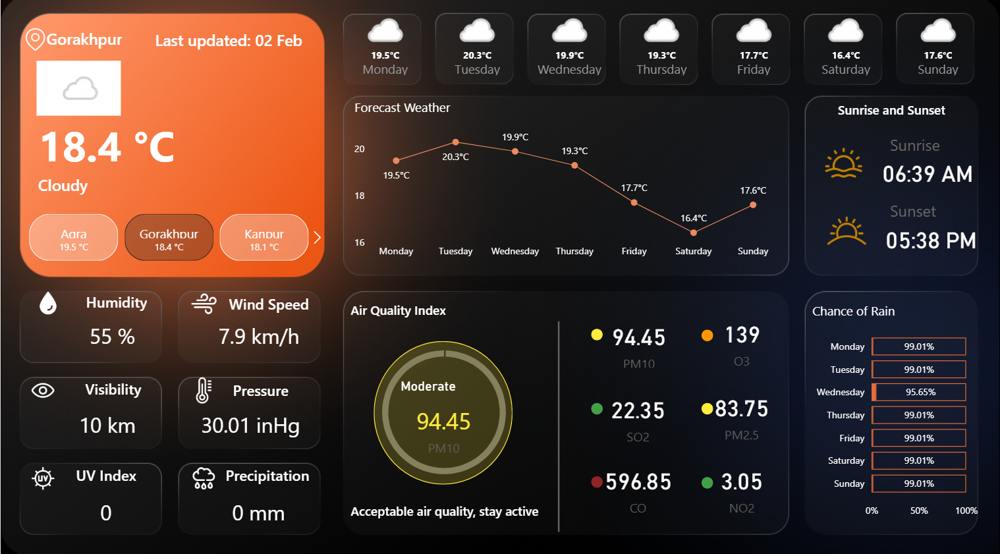

# Weather Insights Dashboard (Power BI)

An interactive **Power BI dashboard** that visualizes real-time weather conditions, multi-day forecasts, and air quality insights using data fetched from a **Weather API**.  
Designed with a clean dark-theme UI to deliver clear, insight-driven analytics.

---

## 🎯 Objective

The objective of this project is to:
- Integrate **API-based weather data** into Power BI  
- Present weather and air quality insights in a **clear, intuitive dashboard**  
- Enable **city-wise comparison** for informed decision-making  
- Demonstrate strong **data modeling and visualization** skills  

---

## 📊 Dashboard Preview



---

## 🌍 Cities Covered

**Lucknow | Agra | Kanpur | Noida | Gorakhpur**

Weather data is dynamically fetched using a **Weather API**, enabling seamless city-wise analysis.

---

## 🔍 Key Features

- 🌡️ Current temperature with weather condition  
- 📅 7-day weather forecast with trend visualization  
- 🌅 Sunrise and sunset timings  
- 🌬️ Wind speed, humidity, visibility, and pressure metrics  
- 🌫️ **Air Quality Index (AQI)** with pollutant-level insights  
- ☔ Chance of rain analysis for upcoming days  
- 🎨 Clean and modern dark-theme dashboard design  

---

## 🌫️ Air Quality Index (AQI) Parameters

**PM10 | PM2.5 | CO | SO2 | NO2 | O3**

---

## 🔗 Data Source

- **Weather API**
  - Provides real-time and forecasted weather data
  - Includes city-based air quality metrics

---

## 🛠️ Tools & Technologies Used

**Power BI | DAX | Weather API | Data Modeling | Data Visualization & Dashboard Design**

---

## 📁 Repository Structure

```text
weather-insights-dashboard/
├── README.md
├── LICENSE
└── assets/
    └── dashboard.png
```
---

## 📄 License

This project is licensed under the **MIT License**.

---
